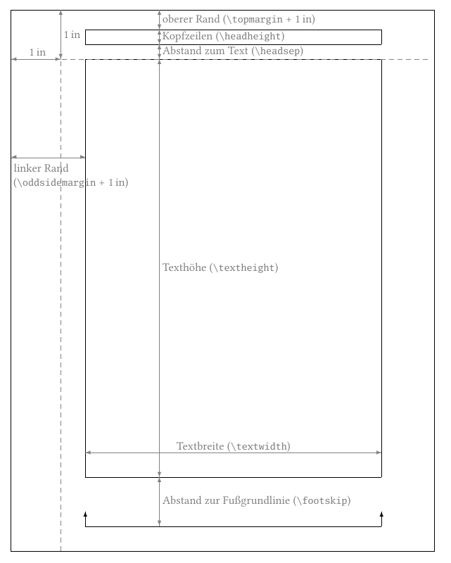
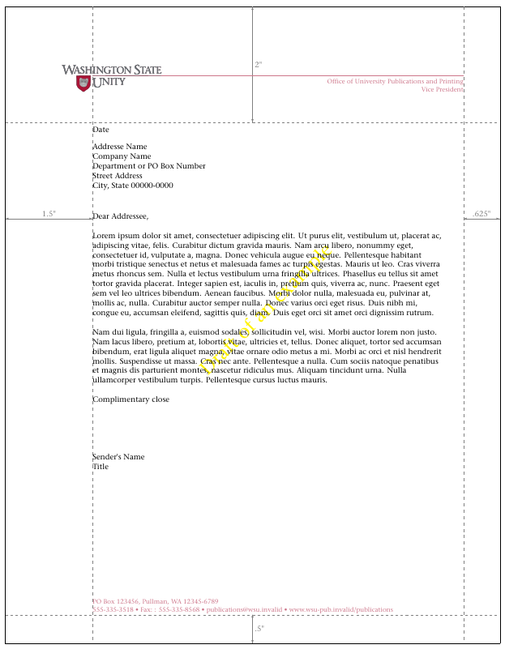

# Wie LCO-Dateien zur Umsetzung einer komplexen Corporate Identity erstellt werden am Beispiel der Washington State University

Ziel dieses Projekts ist die Erstellung einer *Letter Configuration Option*
(LCO-Datei) zur Umsetzung einer Corporate Identity. Als Vorlage für diese
Beispielimplementierung dient das Briefpapier der Washington State
University. Dieses Beispiel basiert meinerm Artikel in [»Die TeXnische
Komödie«, Ausgabe 4/2012](http://archiv.dante.de/DTK/PDF/komoedie_2012_4.pdf),
Seite 58–73.

## Vorbereitung

Zunächst einmal muss man sich für ein solches Vorhaben alle benötigten
Informationen und Daten besorgen. An erster Stelle stehen dabei
Layoutvorschriften. Im konkreten Fall habe ich diese [einem Beitrag auf
TeX.StackExchange](https://tex.stackexchange.com/q/59932) entnommen.

Vorgefertigte Briefbögen tragen häufig ein Logo. Je nachdem, ob LaTeX,
PDFLaTeX, XeLaTeX oder LuaLaTeX zum Einsatz kommen soll, benötigt man das Logo
in unterschiedlichen Formaten. Im konkreten Fall kann man sich verschiedene
[Logos im EPS-Format von der Homepage der Washington State
University](https://brand.wsu.edu/wp-content/themes/brand/downloads/university/WSU-Univ-wide_Logos.zip)
herunterladen. Teilweise haben diese Logos im EPS-Format eine Menge störenden
Rand. Diesen kann man sehr einfach entfernen, indem man das Logo zunächst mit
`epstopdf` in eine PDF-Datei umwandelt und dann mit `pdfcrop` den
überflüssigen, weißen Wand entfernt. Bei Bedarf kann man anschließend mit
`pdftops` auch wieder eine EPS-Datei ohne den störenden Rand erzeugen.

Da aus rechtlichen Gründen die Weitergabe des Logos aber ohnehin nicht in
Frage kommt, habe ich mit Hilfe von Inkscape einfach ein neues Beispiellogo
[`wsuSig4cW-new.svg`](wsuSig4cW-new.svg) erstellt. Dieses ist ebenfalls als
[PNG](wsuSig4cW-new.png) und als [EPS](wsuSig4cW-new.eps) verfügbar und sieht
so aus:

](wsuSig4cW-new.svg)

Es sei darauf hingewiesen, dass durch die Verwendung des Ersatzlogos
geringfügige Abweichungen bei den Farben auftreten. Entsprechende Anpassungen
sollten bei Bedarf einfach möglich sein.

## Umsetzung des Layouts

Zur Umsetzung seien mir einige Vorbemerkungen erlaubt. Zunächst sei darauf
hingewiesen, dass alle hier verwendeten
[KOMA-Script](https://www.ctan.org/pkg/koma-script)-Anweisungen und die Theorie
zu \emph{LCO}-Dateien, Pseudo-Längen und Variablen sowohl im
[KOMA-Script-Buch](https://komascript.de/komascriptbuch) als auch in der
KOMA-Script-Anleitung zu finden sind. Die KOMA-Script-Anleitung ist in
deutscher und englischer Sprache Bestandteil der
[KOMA-Script-Sammlung](https://www.ctan.org/pkg/koma-script). KOMA-Script kann
bei Bedarf bei jeder aktuellen TeX-Distribution über den jeweiligen
Paketmanager nachinstalliert werden. In der Standardinstallation von TeX-Live
ist es normalerweise bereits installiert. Weder auf die Installation von
KOMA-Script noch auf die erwähnten Grundlagen-Themen aus der Anleitung soll im
Rahmen dieses Artikels näher eingegangen werden.

### Identifikation

Die Umsetzung der Layout-Vorgaben erfolgt in einer eigenen
LCO-Datei. Diese bekommt den passenden Namen [`wsu.lco`](wsu.lco}:
```latex
\ProvidesFile{wsu.lco}[2021/09/15 v1.03 
  unsupported letter class option for Washington State Unity]
```
Mit dieser Anweisung erklären wir LaTeX, worum es sich bei der atei handelt. Die
entsprechenden Informationen sind beispielsweise über die Anweisung
`\listfiles` für eine Übersichtstabelle am Ende der `log`-Datei
verfügbar.

Wie bereits Eingangs erwähnt, diente das Briefpapier der Washington State
University ledigich als Vorlage. Deshalb wird hier eine imaginäre »Washington
State Unity« statt der Universität genannt.

Damit bei Verwendung der LCO-Datei mit der falschen Papiergröße eine
Warnung ausgegeben wird, sollte die geplante Größe zusammen mit dem
LCO-Namen vermerkt werden:
```latex
\LetterOptionNeedsPapersize{wsu}{letter}
```
Im Falle einer amerikanischen Universität gehe ich davon aus, dass das
letter-Format gewünscht wird.

Außerdem werden gleich zu Anfang noch zwei Befehle für Warnungen und
Fehlermeldungen definiert.
```latex
\providecommand*\LCOWarning[2]{%
  \GenericWarning{%
    (#1)\@spaces\@spaces\@spaces\@spaces\@spaces\@spaces\@spaces
  }{%
    Letter class option #1 Warning: #2%
  }%
}
\providecommand*\LCOError[3]{%
  \GenericError{%
    (#1)\@spaces\@spaces\@spaces\@spaces\@spaces\@spaces\@spaces
  }{%
    Letter class option #1 Error: #2%
  }{%
    See the #1 package documentation for explanation.%
  }{#3}%
}
```
Die beiden Befehle arbeiten wir `\PackageWarning` und `\PackageError`, die in
[»LaTeX2ε for class and package
writers«](http://mirrors.ctan.org/macros/latex/base/clsguide.pdf) dokumentiert 
sind. Für die Definition wurde `\providecommand` verwendet für den Fall dass
die Anweisungen bereits in `scrlttr2` bzw. `scrletter` oder einer anderen
LCO-Datei definiert sind.

### Seitenspiegel

Bereits unabhängig vom Briefbogen selbst, muss für alle Seiten ein
Seitenspiegel, bestehend aus Satzspiegel und Stegen festgelegt werden. Kopf-
und Fußzeilen sind je nach ihrer Wirkung als Teil des Satzspiegels oder der
Stege zu betrachten. LaTeX selbst unterscheidet vertikal zwischen oberem
Rand, Kopfzeilen, Abstand zum Textbereich, Textbereich und Abstand zur
Grundlinie der Fußzeilen:



Der untere Rand ergibt sich implizit. Eine definierte Höhe für den Fuß
existiert im Gegensatz zur definierten Höhe des Kopfes nicht. Horizontal wird
zwischem dem linken Rand von ungeraden Seiten, dem linken Rand von geraden
Seiten und dem Textbereich unterschieden. Der rechte Rand sowohl von ungeraden
als auch von geraden Seiten ergibt sich implizit. Bei einseitigen Dokumenten
wird nur der linke Rand von ungeraden Seiten verwendet – auch für gerade
Seiten.

Die Vorschriften für die Seitenränder und den Textbereich sind
[auf TeX.SX](https://tex.stackexchange.com/q/59932) wie folgt angegeben:
> All text in one-and-onehalf inches from the left [\dots] Begin the letter
> two inches from the top [\dots] The maximum line length should not exeed six
> inches [\dots] If additional pages are needed, the left-hand margin of the
> letter should be maintained, but the text may be started one inch from the
> top.
Die [zugehörige Abbildung](https://i.stack.imgur.com/9u6Cr.gif) gibt außerdem
einen rechten Rand von fünfachtel Zoll und einen unteren Rand von einem halben
Zoll an.

Diese Angaben können verwendet werden, um Ränder und Satzspiegel
einzustellen. Dabei gehe ich aufgrund der Vorschrift, dass auf Extraseiten der
Text abweichend vom Briefbogen bereits ein Zoll unter der Oberkante beginnen
soll, davon aus, dass auf diesen weiteren Seiten kein Logo mehr verwendet werden
soll. Trotzdem schaffe ich Platz, um das Logo notfalls unter zu bringen,
jedoch deutlich höher als auf dem Briefbogen:
```latex
\topmargin=-.75in% plus the 1in from the default offset
\headheight=.5in
\headsep=.25in
\oddsidemargin=.5in% plus the 1in from the default offset
\textwidth=\dimexpr\paperwidth-1.5in-.625in\relax
\ifdim\textwidth>6in
  \textwidth=6in
\fi
\evensidemargin=-.375in% plus the 1in from default offset
\textheight=\dimexpr\paperheight-1in-1.5in\relax
\footskip=1in
\topskip=8.4bp% 0.7 * 12bp (should be \ht\strutbox)
```
Die Einstellungen werden hier direkt vorgenommen. Damit ist die LCO
nicht vom Paket [`geometry`](https://www.ctan.org/pkg/geometry)
abhängig. Gleichzeitig kann so die Textbreite einfach zunächst berechnet
werden und dann für den Fall, dass die berechnete Breite größer als die
angegebene Grenze von sechs Zoll ist, diese als neuer Wert gesetzt werden. Zu
beachten ist allerdings, dass von den verlangten Werten für den oberen und den
linken Rand jeweils ein Zoll abgezogen werden muss. Dies Verschiebung des
Ursprungs, die in der Abbildung oben durch gestrichelte Linien verdeutlicht
wird, hat historische Gründe. Es sei an dieser Stelle auch darauf hingewiesen,
dass `\evensidemargin` nicht der rechte Rand ist, sondern der linke Rand von
geraden Seiten im doppelseitigen Satz.

Falls Sie aber lieber mit `geometry` arbeiten möchten, so wäre auch das
möglich. Allerdings sollte man in einer LCO-Datei nicht einfach Pakete laden,
da es dafür bereits zu spät sein könnte. Wir werden auf dieses Problem im
weiteren Verlauf noch zurück kommen.

Die Werte für `\textheight` und `\footskip` sind geschätzt. Für den Briefbogen
sind diese Werte kaum von Bedeutung und für die weiteren Seiten fehlen
konkrete Angaben in den Vorschriften. Im Endeffekt resultieren die angegebenen
Werte in einem Abstand von ein-einhalb Zoll zwischen dem Ende des Textbereichs
und dem Papierende und einem Rand von einem halben Zoll unterhalb der
Fußzeilen. Dies erscheint mir ein tauglicher Kompromiss zwischen typographisch
optimierten Werten und dem häufigen Wunsch, möglichst viele Zeilen auf eine
Seite zu bekommen. Bei einer Vergrößerung von `\textheight` sollte `\footskip`
entsprechend verkleinert werden und umgekehrt, damit der Rand unter den
Fußzeilen gleich bleibt.

Der Wert für `\topskip` definiert sozusagen, wie hoch die oberste Zeile des
Textbereichs über der Grundlinie maximal sein darf, damit die Grundlinie nicht
nach unten verschoben werden muss. Der angegebene Wert sollte für einen
Grundlinienabstand von 12bp genügen.

Üblicherweise sollte `\textheight` eigentlich ein ganzzahliges Vielfaches von
`\baselineskip` zuzüglich `\topskip` sein. Dadurch wird verhindert, dass der
vertikale Seitenausgleich der Einstellung `\flushbottom` die Absätze
auseinander ziehen muss. Dieser ist bei doppelseitigen Dokumenten
normalerweise obligatorisch. Da Briefe selten als doppelseitiges Werk gebunden
werden, kann man aber selbst bei doppelseitigen Briefen in der Regel getrost
mit `\raggedbottom` arbeiten, also den vertikalen Ausgleich
deaktivieren. Daher wurde hier diesbezüglich kein Aufwand getrieben.

Da man eine LCO-Datei auch noch nach `\begin{document}` laden kann, müssen
diese Seitenspiegeleinstellungen gegebenenfalls noch zu interne LaTeX-Längen
verrechnet werden. Dazu dient bei KOMA-Script die Anweisung:
```latex
\activateareas
```

### Schrift

Bezüglich der Schrift ist [auf TeX.SX](https://tex.stackexchange.com/q/59932)
lapidar vermerkt:
> The format shown here is typeset in ITC Stone Serif, 9.5 on 12, the
>  commended typeface for University correspondence.
Ich interpretiere diese Angabe so, dass die Schrift `ITC Stone Serif` in der
Größe 9,5 Punkt, mit einem Grundlinienabstand von 12 Punkt verwendet werden
soll. Dazu ist zu erwähnen, dass `ITC Stone Serif` eine kommerzielle Schrift
ist, die sich inzwischen einiger Beliebtheit erfreut. Meines Wissens verwendet
beispielsweise auch die TU Clausthal diese Schrift.

Die gut ausgebaute OpenType-Schriftfamilie ist für einen durchaus angemessenen
Preis zu bekommen. Mitarbeiter der Washington State University können eine
Lizenz über einen internen Bestellvorgang erwerben. Dennoch wollte ich die
LCO-Datei nicht zwingend auf eine bestimmte, kommerzielle Schrift
festlegen. Deshalb wird eine Option definiert, die es ermöglicht, die
Schriftvorgabe zu ignorieren:
```latex
\DefineFamily{wsu}
\DefineFamilyMember[.wsu.lco]{wsu}
\FamilyBoolKey[.wsu.lco]{wsu}{nostone}{@nostone}
\FamilyProcessOptions[.wsu.lco]{wsu}
```
Zunächst wird mit Hilfe der Anweisung `\DefineFamily` aus dem
KOMA-Script-Paket `scrbase` eine neue Familie für Schlüssel
definiert. Die Verwendung des Paket `scrbase` bietet sich für die
Definition der Option an, da es von allen KOMA-Script-Klassen ohnehin geladen
wird.

Dann wird mit `\DefineFamilyMember` in der Familie ein neues Mitglied
geschaffen. Mit Hilfe von `\FamilyBoolKey` wird die neue Option `nostone`
definiert. Deren Einstellung kann später über die Verzweigung `\if@nostone`
abgerufen werden.

Da dies vorerst die einzige Option ist, werden zum Schluss noch die Optionen
des neuen Familienmitglieds abgearbeitet. Die Anweisung `\LoadLetterOption`,
mit der LCO-Dateien geladen werden, kennt keine Optionenübergabe. Deshalb
bleibt als einzige Möglichkeit, diese Option bei `\documentclass`
anzugeben. Das kann allerdings dazu führen, dass die Option als *unused global
option*, also als nicht verwendete globale Option gemeldet wird, wenn
`wsu.lco` erst nach `\begin{document}` geladen wird. Ich betrachte das
lediglich als verzeihlichen Schönheitsfehler.

Falls die Option nicht gesetzt wurde, wenn also bei `\if@nostone` lediglich
der `\else`-Zweig gültig wäre, soll auch gleich die Schrift
`ITC Stone Serif` als Standardschrift eingestellt werden:
```latex
\if@nostone\else
  \if@atdocument
    \scr@ifundefinedorrelax{setmainfont}{%
      \LCOWarning{wsu}{%
        You've not loaded package `fontspec',\MessageBreak
        and know it's to late to do so.\MessageBreak
        Because of this option `nostone' has\MessageBreak
        been activated%
      }%
      \Family@Options{wsu}{nostone}{}%
    }%
  \else
    \RequirePackage{fontspec}%
    \KOMAoptions{fontsize=10bp}%
    \setmainfont[Scale=0.95,
%      BoldFont=(* Semibold),% change this to use Bold instead of Semibold
%      ItalicFont=(* Italic),
%      BoldItalicFont=(* Semibold Italic),% change this to use Bold instead of
%                                % Semibold
%      SlantedFont=(* Italic),% we use italic instead of slanted
%      BoldSlantedFont=(* Semibold Italic)
    ]{ITC Stone Serif LT}% gives us 9.5bp on 12bp
    \selectfont
  \fi
\fi
```
Da die Einbindung der Schrift mit PDFLaTeX recht aufwändig sein kann, habe
ich mich für die ausschließliche Verwendung von XeLaTeX oder LuaLaTeX
entschieden. Hier kann die systemweit installierte Schrift über das Paket
[`fontspec`](https://www.ctan.org/pkg/fontspec) geladen werden.

Leider ergibt sich dadurch bereits wieder ein Problem: Pakete können nur in
der Dokumentpräambel geladen werden. LCO-Dateien können jedoch auch noch zu
einem späteren Zeitpunkt geladen werden. Deshalb wird mit der Verzweigung
`\if@atdocument`, die ebenfalls von `scrbase` bereitgestellt wird, zunächst
getestet, ob wir uns bereits nach `\begin{document}` befinden. Falls das der
Fall ist und der normalerweise von `fontspec` bereitgestellte Befehl
`\setmainfont` nicht zur Verfügung steht, wird eine entsprechende Warnung
ausgegeben.

Befinden wir uns hingegen noch in der Präambel, so wird mit `\RequirePackage`
zunächst sichergestellt, dass das Paket `fontspec` geladen ist. Danach stellen
wir als Schriftgröße 10bp ein. Das steht zwar im Widerspruch zur geforderten
Schriftgröße von 9,5 Punkt, der Grundlinienabstand passt dann aber
grundsätzlich schon einmal. Die Einheit bp, also *big point*, wird deshalb
gewählt, weil die Vorgaben für Word-Benutzer definiert sind und der dortige
Punkt dieser Einheit entspricht.

Also nächstes wird die gewünschte Schrift geladen. Leider stand mir statt der
OpenType-Familie `ITC Stone Serif` nur die TrueType-Version `ITC Stone Serif
LT` zur Verfügung. Die Optionen zur Auswahl anderer Schnitte, die bei OpenType
angegeben werden können, sind in obigem Code deshalb auskommentiert.

Beim Laden wird die Schrift per Option mit dem Faktor 0,95 skaliert, also
geringfügig verkleinert. Damit wird erreicht, dass statt einer 10bp-Schrift
tatsächlich dich nur 9,5bp verwendet werden. Die Vorgabe ist also eingehalten.

### Absatzformatierung

Bezüglich der Absatzformatierung ist [auf
TeX.SX](https://tex.stackexchange.com/q/59932) zum einen die Angabe:
> Paragraphs are indicated by one line space, with no indention.
zu finden. Darüber hinaus zeigt [die
Abbildung](https://i.stack.imgur.com/9u6Cr.gif), dass mit linksbündigem
Flattersatz ohne Trennung gearbeitet werden soll. Beides ist rasch
eingestellt:
```latex
\KOMAoption{parskip}{full}
\raggedright
\let\raggedsignature\raggedright
```
Hier wurde die Variante `full` für Option `parskip` gewählt. Weitere Varianten
mit unterschiedlichen Auswirkungen auf die letzte Zeile eines Absatzes stehen
bei KOMA-Script zur Verfügung und können in der Anleitung nachgelesen werden.

Bei der Gelegenheit wurde nicht nur der Text selbst linksbündig gesetzt. Die
letzte Zeile in obigem Code sorgt außerdem dafür, dass auch Schlussgruß und
Signatur zueinander linksbündig angeordnet werden. Mir erscheint das bei einem
Brief im Flattersatz die einzig, sinnvolle Form.

### Logo und Farbe

Wie das Logo erzeugt wird, wurde bereits in den Vorbereitungen erklärt. Auf
dem Briefbogen soll außerdem eine farbige Linie zum Einsatz kommen. In der
EPS-Datei meines mit Inkscape abgewandelten Logos sind für die Farbwerte des
Logos folgende Zeilen zu finden:
```postscript
/rg { setrgbcolor } bind def
0.803922 0.462745 0.541176 rg
```
Die erste dieser beiden Zeilen definiert eine PostScript-Anweisung zur Auswahl
einer Farbe im rgb-Modell. In der zweiten Zeile wird diese dann verwendet, um
eine konkrete Farbe auszuwählen. Dabei ist die Abfolge der Werte wie gewohnt
Rot, Grün, Blau und die Werte sind im Bereich zwischen Null und Eins
angegeben. Das passt also zur Definition mit der Anweisung `\definecolor`
aus einem der Pakete [`color`](https://www.ctan.org/pkg/color) oder
[`xcolor`](https://www.ctan.org/pkg/xcolor). Wird das Original-Logo verwendet,
könnte die Farbe leicht abweichen und muss ggf. mit einem geeigneten Werkzeug
ermittelt werden.

Wir benötigen also eines der Pakete `color` oder `xcolor` und zusätzlich das
Paket [`graphicx`](https://www.ctan.org/pkg/graphicx). Hier ergibt sie
dasselbe Problem wie bereits für im Abschnitt über die Schrift für `fontspec`
erklärt.
```latex
\if@atdocument
  \scr@ifundefinedorrelax{ver@graphicx.sty}{%
    \LCOError{wsu}{%
      package `graphicx' missing%
    }{%
      This LCO needs package `graphicx', but it's to late to load it
      myself.\MessageBreak
      You either should load this LCO before
      \string\begin{document},\MessageBreak
      or load package `graphicx' yourself.%
    }%
  }{}%
  \scr@ifundefinedorrelax{definecolor}{%
    \LCOError{wsu}{%
      command `\string\definecolor' missing%
    }{%
      This LCO needs command \string\definecolor, but it's to late to load a
      package myself.\MessageBreak
      You either should load this LCO before
      \string\begin{document},\MessageBreak
      or load package `xcolor' or `color' yourself.%
    }%
  }%
\else
  \RequirePackage{graphicx}%
  \IfFileExists{xcolor.sty}{\RequirePackage{xcolor}}{\RequirePackage{color}}%
\fi
```
Hauptunterschied ist hier, dass Farbe und Logo unverzichtbar sind und deshalb
ggf. nicht nur gewarnt, sondern ein Fehler gemeldet wird.

Sobald sichergestellt ist, dass die Pakete geladen sind, können Farbe und Logo
definiert werden:
```latex
\definecolor{wsuSig4cW}{rgb}{0.67451,0.682353,0.686275}
\setkomavar{fromlogo}{%
  \includegraphics[height=.5in]{wsuSig4cW-new}%
}
```
Die gewünschte Größe des Logos wurde dabei über den Daumen gepeilt.

### Definition des Briefbogens

Zunächst fällt auf, dass weder Faltmarken noch Rücksendeadresse verwendet
werden:
```latex
\KOMAoptions{foldmarks=false,backaddress=False}
```
Beide sind per Option rasch abgeschaltet.

Als nächstes ist [auf TeX.SX](https://tex.stackexchange.com/q/59932) für den
Briefkopf angegeben:
> All text in one-and-onehalf inches from the left, flush left with the
> crimson line in the Washington State University signature. Begin the letter
> two inches from the top, with the date followed by two line spaces, then the
> address, another line space, then the salutation.
Das sind eine Menge Informationen.

Beginnen wir mit dem Briefkopf:
```latex
\setplength{firstheadvpos}{1in}
\setplength{firstheadhpos}{\dimexpr 2in-1.03in\relax}
\setplength{firstheadwidth}{%
  \dimexpr\paperwidth-\useplength{firstheadhpos}-.625in\relax
}
```
Die vertikale Position des Logos lässt sich aus der [Abbildung auf
TeX.SW](https://i.stack.imgur.com/9u6Cr.gif) relativ leicht ermitteln. Der
obere Rand, über dem Logo wird von mir auf ein Zoll geschätzt. Die Höhe des
Logos selbst und der Abstand zwischen dem Logo und dem Textbereich scheinen
ungefähr gleich zu sein. Für die horizontale Position habe ich jedoch zum
Lineal gegriffen und ermittelt, dass die horizontale Linie, die in der
Erklärung als *crimson line* angegeben ist, 1,03 Zoll rechts von der linken
Kante des Logos beginnt. Entsprechend wurde `firstheadhpos` berechnet. Der
Kopf selbst soll sich gemäß der Bemaßung derselben Abbildung bis fünfachten
Zoll vor der rechten Papierkante erstrecken. Auch dies ist einfach zu
berechnen.
 
Als nächstes folgt in der Erklärung die Position des Datums:
```latex
\KOMAoption{refline}{dateleft}
\setplength{refvpos}{2in}
\setplength{refaftervskip}{8\baselineskip}
\setplength{refhpos}{\dimexpr\oddsidemargin+1in\relax}
```
Das Datum wird bei `scrlttr2` und `scrletter` automatisch in der
Geschäftszeile gesetzt. Über die Option `refline` kann dabei gewählt werden,
dass das Datum links gesetzt werden soll. Der Abstand zwischen Geschäftszeile
und Anrede ergibt sich aus zwei Zeilen Abstand zur Anschrift, fünf Zeilen
Anschrift in der Beispielabbildung und einer weiteren Zeile Abstand zur
Anrede. 

Damit ist aber auch fest definiert, dass die Anschrift immer
mindestens fünf Zeilen zu umfassen hat:
```latex
\setplength{toaddrhpos}{\useplength{refhpos}}
\setplength{toaddrvpos}{\dimexpr\useplength{refvpos}+2\baselineskip\relax}
\setplength{toaddrheight}{5\baselineskip}
\setplength{backaddrheight}{0pt}
```
Die Höhe der Rücksendeadresse begründet sich daraus, dass eine solche offenbar
nicht verwendet werden soll. Alle anderen Werte ergeben sich ebenfalls aus den
vorgenannten Angaben und Überlegungen.

Definieren wir nun den Inhalt des Briefkopfs:
```latex
\setkomavar{firsthead}{%
  \color{wsuSig4cW}\footnotesize
  \makebox[0pt][l]{%
    \makebox[\useplength{firstheadwidth}][r]{%
      \raisebox{\baselineskip}{%
        \rule{\dimexpr\paperwidth-1.5in-.625in\relax}{.5bp}%
      }%
    }%
  }%
  \raisebox{\dimexpr \baselineskip-.31in+.5bp\relax}{%
    \usekomavar{fromlogo}
  }%
  \hfill
  \begin{tabular}[t]{@{}r@{}}
    \usekomavar{office}
  \end{tabular}
  \par
}
```
Zunächst wird die Farbe für die Linie und den Text rechts unter der Linie
eingestellt. Ich verwende hier für beides dieselbe Farbe. Man könnte aber
später für den Text rechts unter der Linie auch noch einmal die Farbe
wechseln. Die Schriftgröße für den Text erscheint mir mit `\footnotesize`
passend.

Dann geht es darum eben diese Linie zu setzen. Breite und Höhe der Linie sind
aus der Abbildung zu bestimmen. Das sind die Argumente von `\rule`. Die Linie
soll über dem rechtsbündig zu setzenden Text erscheinen. Daher wird sie mit
`\raisebox` entsprechend nach oben verschoben. Sie soll außerdem rechtsbündig
innerhalb der Breite des Kopfes gesetzt werden. Dazu dient die innere
`\makebox`-Anweisung. Anschließend wollen wir das Logo über dieser Linie
platzieren. Das Setzen der Linie darf also die horizontale Position nicht
ändern. Dazu verwenden wir die äußere `\makebox`-Anweisung, bei der als Breite
0pt angegeben wurde, wobei innerhalb dieser Breite linksbündig gesetzt werden
soll.

Als nächstes wird das Logo ausgegeben. Auch diese muss nach oben verschoben
werden und zwar so weit, dass die Linie innerhalb des Logos genau
deckungsgleich mit der soeben gezeichneten Linie ist. Bei der Berechnung der
Verschiebung wurde die Verschiebung `\baselineskip` der Linie und die Dicke
0,5bp der Linie übernommen. Die restliche Verschiebung um 0,31in wurden im
Logo ausgemessen.

Als letztes wird rechtsbündig der Text gesetzt. Damit der Text austauschbar
ist, wurde hierfür die Variable `office` verwendet. Damit diese auch
mehrzeilig sein darf, wird sie in einer Tabelle gesetzt, deren oberste Zeile
mit der Grundlinie ausgerichtet ist. Mehrzeilige Textangaben werden dabei
rechtsbündig gesetzt. Man könnte sie auch innerhalb des Textblocks linksbündig
oder zentriert setzen, indem man die Spaltendefinition `@{}l@{}` oder
`@{}c@{}` verwendet.

Die Variable, die in der Kopfdefinition verwendet wurde, ist keine von
KOMA-Script vordefinierte Variable:
```latex
\newkomavar{office}
```
Die neue Variable wurde hier ohne druckbaren Bezeichner definiert, da ein
solcher auch nicht verwendet wird.

Bevor wir zum Fuß kommen, beachten wir noch die Angabe
> After the complimentary close, allow five line spaces fot the signature.
bezüglich der Signatur:
```latex
\setplength{sigbeforevskip}{5\baselineskip}
```
Hier, wie bei allen anderen Werten, die zuvor bereits von `\baselineskip`
abhängen, wird davon ausgegangen, dass die Grundschriftgröße nach dem Laden
der LCO-Datei nicht mehr geändert wird.

Es geht weiter mit dem Fuß des Briefbogens:
```latex
\setplength{firstfootvpos}{\dimexpr\paperheight-.5in-\dp\strutbox\relax}
\setplength{firstfoothpos}{\useplength{refhpos}}
\setplength{firstfootwidth}{\textwidth}
```
Die Platzierung ergibt sich allein aus der [Abbildung auf
TeX.SX](https://i.stack.imgur.com/9u6Cr.gif). Nähere textuelle Angaben dazu
finden sich nicht.

Der Inhalt besteht aus Adresse und weiteren Informationen zum Absender:
```latex
\setkomavar{firstfoot}{%
  \parbox[b][0pt][b]{\textwidth}{\raggedright\footnotesize\color{wsuSig4cW}%
    \Ifkomavarempty{fromaddress}{}{%
      {\renewcommand*{\\}[1][]{, \ignorespaces}\usekomavar{fromaddress}}\\
    }%
    \newcommand*{\elementsep}{}%
    \newcommand*{\xelementsep}{\ \textbullet\ }%
    \Ifkomavarempty{fromphone}{}{%
      \elementsep
      \usekomavar{fromphone}%
      \let\elementsep\xelementsep}%
    \Ifkomavarempty{fromfax}{}{%
      \elementsep
      \usekomavar*{fromfax}: \usekomavar{fromfax}%
      \let\elementsep\xelementsep}%
    \Ifkomavarempty{fromemail}{}{%
      \elementsep
      \usekomavar{fromemail}%
      \let\elementsep\xelementsep}%
    \Ifkomavarempty{fromurl}{}{%
      \elementsep
      \usekomavar{fromurl}}%
  }%
}
```
Die einzelnen Angaben sind in Standard-Variablen von `scrlttr2` und
`scrletter` abgelegt. Sie werden nur dann ausgegeben, wenn sie nicht leer
sind. Dies wird `\Ifkomavarempty` erreicht. Trickreich ist dabei die
Entscheidung, ob ein Trennzeichen vor einem Feld auszugeben ist. Dies wird
dadurch gelöst, dass eine zunächst leer definierte Anweisung zu dem
Trennzeichen umdefiniert wird, wenn ein Feld ausgegeben wurde.

Damit ist die Form des Briefbogens aber auch das Layout der Folgeseiten
vollständig definiert.

### Personalisierung

Bevor der erste Brief mit dem neuen, nachgebauten Layout erstellt wird, sollte
der Absender noch eine weitere LCO-Datei [`wsu-johndoe.lco`](wsu-johndoe.lco)
mit seinen persönlichen Daten erstellen.
```latex
\LoadLetterOption{wsu}

\setkomavar{date}{\today}
\setkomavar{signature}{John Doe\\
  Vice President}
\setkomavar{office}{Office of University Publications and Printing}
\setkomavar{fromaddress}{PO Box 123456\\ Pullman, WA 12345-6789}
\setkomavar{fromphone}{555-335-3518}
\setkomavar{fromfax}{555-335-8568}
\setkomavar{fromemail}{publications@wsu.invalid}
\setkomavar{fromurl}{www.wsu-pub.invalid/publications}
```

## Abwandlung: Verwendung von `geometry`

Wie bereits erwähnt, könnte man für die Einstellung des Seitenspiegels in
`wsu.lco` auch das Paket `geometry` verwenden. Der Code dazu
könnte beispielsweise so aussehen:
```latex
\if@atdocument
  \scr@ifundefinedorrelax{newgeometry}{%
    \LCOError{wsu}{%
      command `\string\newgeometry' missing%
    }{%
      This LCO needs package `geometry', but it's to late to load it
      myself.\MessageBreak
      You either should load this LCO before
      \string\begin{document},\MessageBreak
      or load package `geometry' yourself.%
    }%
  }{%
    \newgeometry{left=1.5in,right=.625in,top=1in,includefoot,bottom=.5in}%
    \ifdim \textwidth>6in
      \newgeometry{left=1.5in,width=6in,top=1in,includefoot,bottom=.5in}%
    \fi
  }%
\else
  \RequirePackage{geometry}%
  \geometry{left=1.5in,right=.625in,top=1in,includefoot,bottom=.5in}%
  \AtBeginDocument{%
    \ifdim \textwidth>6in
      \newgeometry{left=1.5in,width=6in,top=1in,includefoot,bottom=.5in}%
    \fi
  }%
\fi
```
Nachteilig dabei ist, dass für doppelseitige Dokumente nur entweder der linke
Rand von geraden Seiten auf fünfachtel Zoll festgelegt werden kann oder die
Breite des Text auf maximal sechs Zoll. Eine Kombination beider Möglichkeiten
wäre nur mit Tricks möglich. Entweder müsste man Vorabberechnungen oder
nachträgliche Vergleiche anstellen und gegebenenfalls `geometry` sogar
mehrfach die Ränder einstellen lassen. Der Aufwand dafür wäre kaum geringer
als die direkte Festlegung der Ränder und des Textbereichs wie sie bereits
gezeigt wurde. Mir erscheint daher im konkreten Fall die zuvor gewählte
Ausnahme von der Regel, dass für konkrete Randangaben `geometry` verwendet
werden sollte, angebracht.

## Zusammenfassung

Es wurde gezeigt, wie man mit den Mitteln der LCO-Datei ein gegebenes
Brieflayout nachbilden kann. Insbesondere wurde der Umgang mit Pseudo-Längen
und Variablen vorgeführt, wie man neue Optionen in LCO-Dateien definieren
kann, und wie das Nachladen von Paketen zu handhaben ist. Beispielhaft wurde
auch die Verbesserung von extern verfügbaren, suboptimalen Grafikdateien
erwähnt.

Abschließend sei ein [Beispielbrief](wsu-brief.tex) gezeigt. Dieser wurde zur
Verdeutlichung der vorgegebenen Ränder mit einigen Hilfslinien versehen und
bemaßt.

](wsu-brief.png)
