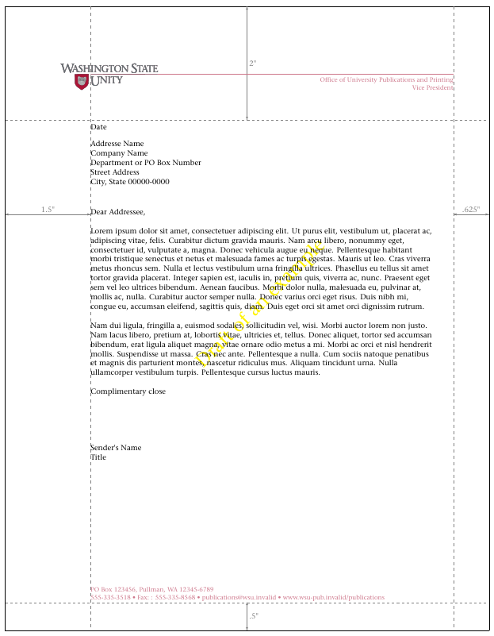

# LCO file for scrlttr2/scrletter notepapers similar to the Washington State University

The purpose of this project is to create a *Letter Configuration Option* (LCO
file) to implement a corporate identity. The Washington State University
letterhead is used as a blueprint for this sample implementation. This example
is based on my article in ["The TeXnical Comedy", issue
4/2012](http://archiv.dante.de/DTK/PDF/komoedie_2012_4.pdf), pages 58-73.

## Preliminary

First of all, you need to get all the necessary information and data for such
a project. First of all, there are layout rules. In the concrete case I have
taken these [from a post on
TeX.StackExchange](https://tex.stackexchange.com/q/59932).

Prefabricated letterheads often carry a logo. Depending on LaTeX, PDFLaTeX,
XeLaTeX or LuaLaTeX, you need the logo in different formats. In the concrete
case you can download different [logos in EPS format from the homepage of
Washington State
University](https://brand.wsu.edu/wp-content/themes/brand/downloads/university/WSU-Univ-wide_Logos.zip). Some
of these logos in EPS format have a lot of annoying borders. This can be
removed very easily by first converting the logo to a PDF file using
`epstopdf` to a PDF file and then using `pdfcrop` to remove the superfluous
white wall. If necessary, you can then use `pdftops` to create an EPS file
without the disturbing border.

But since for legal reasons the distribution of the logo is out of the
question anyway, I simply created a new example logo with the help of Inkscape
[`wsuSig4cW-new.svg`](wsuSig4cW-new.svg).This is also available as
[PNG](wsuSig4cW-new.png) and as [EPS](wsuSig4cW-new.eps) and looks like this:

](wsuSig4cW-new.svg).

It should be noted that due to the use of the replacement logo, slight
deviations in the colors occur. Appropriate adjustments should be easily
possible if needed.

## Realization of the Layout

If you will excuse me I'll have a preliminary note to the realization. First
of all note, that all of the [KOMA-Script](https://www.ctan.org/pkg/koma-script) commands that will be used and the
theory of LCO files, pseudo-lengths and variable may be found in the
KOMA-Script manual. The KOMA-Script manual is available in English and in
German, and both are part of the [KOMA-Script bundle](https://www.ctan.org/pkg/koma-script). If required, you may install KOMA-Script in every
current TeX distribution using the package manager of the that
distribution. The default installation of TeX Live, *scheme-full*,
also installs KOMA-Script. So I won't tell any more about the installation of
KOMA-Script, nor a lot about the topics LCO, pseudo-lengths, or
variables.

### Identification

The realization of the layout will be done using a LCO file. I'll use
the appropriate name [`wsu.lco`](wsu.lco):
```latex
\ProvidesFile{wsu.lco}[2021/09/15 v1.03 
  unsupported letter class option for Washington State Unity]
```
This command tells LaTeX, what the file is used for. The given information
will be shown, e.g., by command `\listfiles` in a list at the end of the
log-file.

As mentioned at the beginning of this article, the stationery of Washington
State University only served as a template. Therefore, an imaginary
»Washington State Unity« instead of the university.

KOMA-Script may warn, if someone uses a LCO file with the wrong paper
size.  So we need to tell `scrlttr2` or `scrletter` the LCO name and it's
expected paper size:
```latex
\LetterOptionNeedsPapersize{wsu}{letter}
```
In case of an US-American university I'll expect letter to be the appropriate
paper size.

Two additional commands for warnings and error messages will be defined also:
```latex
\providecommand*\LCOWarning[2]{%
  \GenericWarning{%
    (#1)\@spaces\@spaces\@spaces\@spaces\@spaces\@spaces\@spaces
  }{%
    Letter class option #1 Warning: #2%
  }%
}
\providecommand*\LCOError[3]{%
  \GenericError{%
    (#1)\@spaces\@spaces\@spaces\@spaces\@spaces\@spaces\@spaces
  }{%
    Letter class option #1 Error: #2%
  }{%
    See the #1 package documentation for explanation.%
  }{#3}%
}
```
These commands work like `\PackageWarning` and `\PackageError`, that are
documented in [»LaTeX2ε for class and package
writers«](http://mirrors.ctan.org/macros/latex/base/clsguide.pdf). They has
been defined using `\providecommand`. So it doesn't matter, if they have been
defined already by `scrlttr2` or `scrletter` or another LCO file.

### Page Area

Independent from the note paper a page area consisting of type area and
margins has to be declared for all pages. Page head and page foot may be part
of the type are or the margin depending on their optical impression. LaTeX
itself distinguishes vertically top margin, head, distance between head and
text area, text area, distance to the baseline of the foot:


The bottom margin results implicitly. In opposite to the head theirs no
explicit height of the foot. Horizontally left margin of odd pages, left
margin of even pages and the text area will be distinguished. The right margin
of even or odd pages results implicitly. With one sided documents only the
left margin of odd pages will be used\Dash even for pages with even page
numbers.

The specification for the margins and the text area [on
TeX.SX](https://tex.stackexchange.com/q/59932)) is:
> All text in one-and-onehalf inches from the left […] Begin letter two
> inches from the top […] The maximum length should not exceed six inches
> […] If additional pages are needed, the left-hand margin of the letter
> should maintained, but the text may be started one inch from the top.

The [additional figure](https://i.stack.imgur.com/9u6Cr.gif) additionally
shows a right margin of five-eighth inches and a bottom margin of one-half
inches.

These information may be used to setup margins and text area. Because of the
fact, that the text area on extra pages should start already one inch below
the top edge of the paper, I emanate that those extra pages should not contain
a logo. Nevertheless, I create space to place a logo if needed. But the
placement would be nearer the top edge than on the note paper:
```latex
\topmargin=-.75in% plus the 1in from the default offset
\headheight=.5in
\headsep=.25in
\oddsidemargin=.5in% plus the 1in from the default offset
\textwidth=\dimexpr\paperwidth-1.5in-.625in\relax
\ifdim\textwidth>6in
  \textwidth=6in
\fi
\evensidemargin=-.375in% plus the 1in from default offset
\textheight=\dimexpr\paperheight-1in-1.5in\relax
\footskip=1in
\topskip=8.4bp% 0.7 * 12bp (should be \ht\strutbox)
```

Direct setting of the lengths has been used to avoid making the LCO depending
from package [`geometry`](https://www.ctan.org/pkg/geometry). At once the
width of the text area may be calculated first and in case of the calculated
width exceeds the given limit of six eighth inches is will be set to that
limit. But have to note, that one inch must be subtracted from the specified
values for the top and the left margin. This movement of the origin, that has
been visualized in the figure above by a dashed line, has historical
reasons. You should also note, that `\evensidemargin` is not the right margin,
but the left margin of even pages at double-sided layouts.

Nevertheless, if you like to use `geometry`, this would also be possible. But
you shouldn't load packages inside of a LCO file, because LCO files may be
loaded inside of the document body and loading of packages is allowed only at
the document preamble. More about this problem later.

The values of `textheight` and `footskip` are estimated. For the note paper
these lengths are less important and there aren't any values for them for
extra pages at the specification. The values, that have been used in the
`LCO`, will result in a distance of one and one-half inch between the end of
the text area and the bottom paper edge, and a margin of one-half inch below
the page foot. I suggest, that this would be a usable compromise between
typographic optimization and the often read wish to have as much text rows as
possible. If you'd like to increase `\textheight`, you should decrease
`\footskip` by the same amount and visa versa to avoid changes of the margin
below the foot.

Value `\topskip` may be interpreted as the maximum height of the topmost row
at the text area. If the text above the baseline of this row is higher than
`\topskip` the baseline would be moved down. The selected value of 8.4bp
should be enough for a baseline distance of 12bp.

Usually `\textheight` should be an integer multiple of `\baselineskip` plus
`\topskip`. This would avoid, that `\flushbottom` has to enlarge the paragraph
distance. The vertical alignment of `\flushbottom` is normally obligatory at
double sided documents. But bounding of letters as a double sided document is
very unusual. So you may use `\raggedbottom` even if the letters will be
printed two-sided, and therefor deactivate the vertical alignment with
stretching and upsetting. So nothing has been done to take care of this.

LCO files may be loaded not only in the document preamble but also after
`\begin{document}`. In this case the page area values have to be translated
into internal LaTeX lengths. KOMA-Script provides command
```latex
\activateareas
```
to do this. The command may be used also in the document preamble.

### Fonts

Regarding the font [the TeX.SX
question](https://tex.stackexchange.com/q/59932) simply states:
> The format shown here is typeset in ITC Stone Serif, 9.5 on 12, the
> commended typeface for University correspondence.

My interpretation of this statement reads that the font `ITC Stone Serif` is
to be used with the size 9.5 point with a leading of 12 point. One has to
mention that `ITC Stone Serif` is a commercial font which has gained some
popularity. To my knowledge for example the TU Clausthal uses this font.

The well designed OpenType font family is available for a reasonable price.
Employees of the Washington State University can get a licence via an internal
order. However, I didn't necessarily want to restrict the LCO file to a
certain commercial font. This is why an option is defined which enables to
ignore the default font:
```latex
\DefineFamily{wsu}
\DefineFamilyMember[.wsu.lco]{wsu}
\FamilyBoolKey[.wsu.lco]{wsu}{nostone}{@nostone}
\FamilyProcessOptions[.wsu.lco]{wsu}
```
At first the command `\DefineFamily` from KOMA-Script package `scrbase`
defines a new key family. The usage of `scrbase` makes sense as it is loaded
by every KOMA-Script class anyway.

`\DefineFamilyMember` now creates a new member. `\FamilyBoolKey` now defines
the new option `nostone`. Its value can later be retrieved via the conditional
`\if@nostone`.

Since this is the only option for now, at last the options of the new family
member are processed. The command `\LoadLetterOption` that loads LCO files
cannot retrieve options. So as only possibility remains to pass this option
globally with `\documentclass`. However, this may result in an *unused global
option* if `wsu.lco` is loaded after `\begin{document}`. To me this is an
excusable blemish.

If the option has not been set, i.e., if only the `\else` branch of
`\if@nostone` is valid, `ITC Stone Serif` should be used as default font:
```latex
\if@nostone\else
  \if@atdocument
    \scr@ifundefinedorrelax{setmainfont}{%
      \LCOWarning{wsu}{%
        You've not loaded package `fontspec',\MessageBreak
        and know it's to late to do so.\MessageBreak
        Because of this option `nostone' has\MessageBreak
        been activated%
      }%
      \Family@Options{wsu}{nostone}{}%
    }%
  \else
    \RequirePackage{fontspec}%
    \KOMAoptions{fontsize=10bp}%
    \setmainfont[Scale=0.95,
%      BoldFont=(* Semibold),% change this to use Bold instead of Semibold
%      ItalicFont=(* Italic),
%      BoldItalicFont=(* Semibold Italic),% change this to use Bold instead of
%                                % Semibold
%      SlantedFont=(* Italic),% we use italic instead of slanted
%      BoldSlantedFont=(* Semibold Italic)
    ]{ITC Stone Serif LT}% gives us 9.5bp on 12bp
    \selectfont
  \fi
\fi
```
Since the integration of the font can be laborious with PDFLaTeX I decided
for a usage with XeLaTeX or LuaLaTeX only. Here the system font can be loaded
with the package [`fontspec`](https://www.ctan.org/pkg/fontspec).

Unfortunately this leads to a new problem: packages can only be loaded in the
document preamble but LCO files can be loaded later, too. So we test with the
conditional `\if@atdocument` that is provided by `scrbase`, too, if we already
are after `\begin{document}`. If this is true and the command `\setmainfont`
usually provided by `fontspec` isn't available any more a corresponding
warning is raised.

But if we're still in the preamble we first make sure with `\RequirePackage`
that `fontspec` is loaded. Then we set the font size to 10\,bp. Although this
contradicts the required 9.5 point at least the leading is right already.  The
unit bp, *big point*, is chosen because the requirements are made for Word
users. Its point corresponds to bp.

Now the wanted font is loaded. Unfortunately I don't have the `ITC Stone
Serif` OpenType family available but only the TrueType version `ITC Stone
Serif LT`.  That's why other options to choose different font styles available
for OpenType are commented in the code above.

When the font is loaded it is scaled down a bit by the factor 0.95. This
ensures that instead of a 10bp font a 9.5bp font is used. The requirement is
met.

### Paragraph Formatting

Regarding paragraph formatting [the TeX.SX
post](https://tex.stackexchange.com/q/59932) states:
>  Paragraphs are indicated by one line space, with no indention.

Also the figure shows that a ragged right format without hyphenation is to be
used. Both requirements are easily set:
```latex
\KOMAoption{parskip}{full}
\raggedright
\let\raggedsignature\raggedright
```
For option `parskip` the variant `full` was chosen. KOMA-Script also provides
other variants with different effects on the last line of a paragraph. They
can be read up in the manual.

On this occasion not only the text is set ragged right. The last line of the
code above additionally ensures that the closing and signature are also
aligned left.  To me this is the only rational form in a letter set ragged
right.

### Logo and Color

How the logo is created is already explained in the preliminary. The
letterhead should also contain a colored line. The color specifications can be
found in the EPS file of my with Inkscape modified logo:
```postscript
/rg { setrgbcolor } bind def
0.803922 0.462745 0.541176 rg
```
The first of these lines defines a PostScript instruction to choose a color in
the rgb model. In the second line this instruction is now used to choose an
actual color. As usual the order of the values is red, green, blue and the
values are between zero and one. This fits with the definition of the command
`\definecolor` of one of the packages
[`color`](https://www.ctan.org/pkg/color) or
[`xcolor`](https://www.ctan.org/pkg/xcolor). If the original logo is used the
color might differ and possibly has to be determined with an appropriate tool.

So, we need one of the packages `color` or `xcolor` and additionally the
package [`graphicx`](https://www.ctan.org/pkg/graphicx). Here the same problem
arises as explained for `fontspec`.
```latex
\if@atdocument
  \scr@ifundefinedorrelax{ver@graphicx.sty}{%
    \LCOError{wsu}{%
      package `graphicx' missing%
    }{%
      This LCO needs package `graphicx', but it's to late to load it
      myself.\MessageBreak
      You either should load this LCO before
      \string\begin{document},\MessageBreak
      or load package `graphicx' yourself.%
    }%
  }{}%
  \scr@ifundefinedorrelax{definecolor}{%
    \LCOError{wsu}{%
      command `\string\definecolor' missing%
    }{%
      This LCO needs command \string\definecolor, but it's to late to load a
      package myself.\MessageBreak
      You either should load this LCO before
      \string\begin{document},\MessageBreak
      or load package `xcolor' or `color' yourself.%
    }%
  }%
\else
  \RequirePackage{graphicx}%
  \IfFileExists{xcolor.sty}{\RequirePackage{xcolor}}{\RequirePackage{color}}%
\fi
```
The main difference is that color and logo are indispensable and possibly an
error is raised instead of a warning.

After it is ensured that the packages are loaded color and logo can be
defined:
```latex
\definecolor{wsuSig4cW}{rgb}{0.67451,0.682353,0.686275}
\setkomavar{fromlogo}{%
  \includegraphics[height=.5in]{wsuSig4cW-new}%
}
```
The wanted size of the logo has been estimated.

### Definition of the Letterhead

The first thing to notice is that neither fold marks nor backaddress are used:
```latex
\KOMAoptions{foldmarks=false,backaddress=False}
```
With an option both are easily turned off.

Next [the TeX.SX question](https://tex.stackexchange.com/q/59932) says about
the letterhead:
> All text in one-and-onehalf inches from the left, flush left with the
> crimson line in the Washington State University signature. Begin the letter
> two inches from the top, with the date followed by two line spaces, then the
> address, another line space, then the salutation.

This is a lot of information.

Let's begin with the header:
```latex
\setplength{firstheadvpos}{1in}
\setplength{firstheadhpos}{\dimexpr 2in-1.03in\relax}
\setplength{firstheadwidth}{%
  \dimexpr\paperwidth-\useplength{firstheadhpos}-.625in\relax
}
```

The vertical position of the logo can easily be determined from the [figure on
TeX.SX](https://i.stack.imgur.com/9u6Cr.gif). I estimate the top margin above
the logo to one inch.  The height of the image itself and the distance between
logo and text body seem to be roughly the same. However, for the horizontal
position I took a ruler and measured that the horizontal line that is called
*crimson line* in the description begins 1.03 inch to the right of the
left border of the logo.  According to the figure the head itself spans until
the eighth inch from the right paper border. This also is easily calculated.

The next point is the position of the date:
```latex
\KOMAoption{refline}{dateleft}
\setplength{refvpos}{2in}
\setplength{refaftervskip}{8\baselineskip}
\setplength{refhpos}{\dimexpr\oddsidemargin+1in\relax}
```
`scrlttr2` and `scrletter` automatically place the date in the reference
line. The option `refline` allows to decide wether the date should be placed
on the left. The distance between reference line and salutation arises from
two lines distance to the address, five lines of address and another line
distance to the salutation.

This however fixates that the address always has to consist of five lines:
```latex
\setplength{toaddrhpos}{\useplength{refhpos}}
\setplength{toaddrvpos}{\dimexpr\useplength{refvpos}+2\baselineskip\relax}
\setplength{toaddrheight}{5\baselineskip}
\setplength{backaddrheight}{0pt}
```
Since a backaddress obviously should not be used its height is set to zero.
All other values also are due to the previously mentioned specifications and
considerations.

Now let's define the content of the header:
```latex
\setkomavar{firsthead}{%
  \color{wsuSig4cW}\footnotesize
  \makebox[0pt][l]{%
    \makebox[\useplength{firstheadwidth}][r]{%
      \raisebox{\baselineskip}{%
        \rule{\dimexpr\paperwidth-1.5in-.625in\relax}{.5bp}%
      }%
    }%
  }%
  \raisebox{\dimexpr \baselineskip-.31in+.5bp\relax}{%
    \usekomavar{fromlogo}
  }%
  \hfill
  \begin{tabular}[t]{@{}r@{}}
    \usekomavar{office}
  \end{tabular}
  \par
}
```
At first the color for the line and the text below the line is set. I'm using
the same color for both. It would be possible to change the color for the text
on the right below the line later. To me `\footnotesize` seems to be the right
font size for the text.

Now it's about to set the very line. Width and height are determined from the
figure. They are the argumnets to `\rule`. The line should be right aligned
above the text. This is why it is raised correspondingly with `\raisebox`.
Additionally it should be right aligned within the width of the header.  This
is what the `\makebox` command is for. At last we want to place the logo above
of the line. Hence placing the line must not change the horizontal
position. For this we use an outer `\makebox` with a width of 0pt within which
everything is set left aligned.

Now the logo is set. It also has to be raised until the line within the logo
covers the line we just drew. For the calculation of the shift the shift of
the line, `\baselineskip`, the height of the line, 0.5bp, have been adopted.
The further shift 0.31in has been measured from the logo.

At last the text is set right aligned. In orer to make the text replaceable
the variable `office` has been used. To allow it to spread more lines it
is set in a table whose first line is aligned to the baseline. More lines will
be set right aligned. One also could align the textblock to the left or center
it by changing the column specifications to `@{}l@{}` or `@{}c@{}`.

The variable used in the definition of the head is not predefined by
KOMA-Script:
```latex
\newkomavar{office}
```
The new variable is defined without a printable description as it isn't used
anyway.

Before we come to the footer let's take a look at the requirement:
> After the complimentary close, allow five line spaces fot the signature.

regarding the signature:
```latex
\setplength{sigbeforevskip}{5\baselineskip}
```
Like for all other values depending on \cs{baselineskip} it is assumed that the
basic font size isn't changed any more after loading the \emph{LCO} file.

Continuing with the footer of the letterhead:
```latex
\setplength{firstfootvpos}{\dimexpr\paperheight-.5in-\dp\strutbox\relax}
\setplength{firstfoothpos}{\useplength{refhpos}}
\setplength{firstfootwidth}{\textwidth}
```
The placement solely is taken from the [figure from
TeX.SX](https://i.stack.imgur.com/9u6Cr.gif). There are no further
information.

It contents contain of address and further information about the sender:
```latex
\setkomavar{firstfoot}{%
  \parbox[b][0pt][b]{\textwidth}{\raggedright\footnotesize\color{wsuSig4cW}%
    \Ifkomavarempty{fromaddress}{}{%
      {\renewcommand*{\\}[1][]{, \ignorespaces}\usekomavar{fromaddress}}\\
    }%
    \newcommand*{\elementsep}{}%
    \newcommand*{\xelementsep}{\ \textbullet\ }%
    \Ifkomavarempty{fromphone}{}{%
      \elementsep
      \usekomavar{fromphone}%
      \let\elementsep\xelementsep}%
    \Ifkomavarempty{fromfax}{}{%
      \elementsep
      \usekomavar*{fromfax}: \usekomavar{fromfax}%
      \let\elementsep\xelementsep}%
    \Ifkomavarempty{fromemail}{}{%
      \elementsep
      \usekomavar{fromemail}%
      \let\elementsep\xelementsep}%
    \Ifkomavarempty{fromurl}{}{%
      \elementsep
      \usekomavar{fromurl}}%
  }%
}
```
The individual values are saved in standard variables of \pkgname{scrlttr2}.
They are only used if they're not empty. Tricky is the decision if a separator
has to be used before a field. This is resolved by redefining a previously
empty command if a field has been set.

Now the format of the letterhead and the layout of following pages is defined
completely.

### Personalization

Before a first letter is created with the new rebuilt layout the sender should
create another LCO file [`wsu-johndoe.lco`](wsu-johndoe.lco) containing his
personal data.
```latex
\LoadLetterOption{wsu}

\setkomavar{date}{\today}
\setkomavar{signature}{John Doe\\
  Vice President}
\setkomavar{office}{Office of University Publications and Printing}
\setkomavar{fromaddress}{PO Box 123456\\ Pullman, WA 12345-6789}
\setkomavar{fromphone}{555-335-3518}
\setkomavar{fromfax}{555-335-8568}
\setkomavar{fromemail}{publications@wsu.invalid}
\setkomavar{fromurl}{www.wsu-pub.invalid/publications}
```

# Variation: Use of `geometry`.

As already mentioned, you could also use the `geometry` package for setting
the page area in `wsu.lco`. The code for this could for example look like
this:
```latex
\if@atdocument
  \scr@ifundefinedorrelax{newgeometry}{%
    \LCOError{wsu}{%
      command `\string\newgeometry' missing%
    }{%
      This LCO needs package `geometry', but it's to late to load it
      myself.\MessageBreak
      You either should load this LCO before
      \string\begin{document},\MessageBreak
      or load package `geometry' yourself.%
    }%
  }{%
    \newgeometry{left=1.5in,right=.625in,top=1in,includefoot,bottom=.5in}%
    \ifdim \textwidth>6in
      \newgeometry{left=1.5in,width=6in,top=1in,includefoot,bottom=.5in}%
    \fi
  }%
\else
  \RequirePackage{geometry}%
  \geometry{left=1.5in,right=.625in,top=1in,includefoot,bottom=.5in}%
  \AtBeginDocument{%
    \ifdim \textwidth>6in
      \newgeometry{left=1.5in,width=6in,top=1in,includefoot,bottom=.5in}%
    \fi
  }%
\fi
```
The disadvantage is that for double-sided documents, only either the left
margin of even pages can be set to five-eighths of an inch, or the width of
the text can be set to a maximum of six inches. A combination of both would
only be possible with tricks. Either pre-calculations or subsequent
comparisons would have to be made and, if necessary, 'geometry' would even
have to set the margins several times. The effort for this would hardly be
less than the direct setting of the margins and the text area as already
shown. To me, therefore, the previously chosen exception to the rule that
`geometry` should be used for concrete margin specifications seems appropriate
in the concrete case.

## Summary

It was shown how to recreate a given letter layout using the means of the LCO
file. In particular, the handling of pseudo-lengths and variables was
demonstrated, how to define new options in LCO files, and how to handle
reloading packages. The improvement of externally available, suboptimal
graphics files was also mentioned as an example.

Finally, a [sample letter](wsu-brief.tex) was shown. For the clarification of
the given borders this was provided with some auxiliary lines and dimensioned.

](wsu-brief.png)

## Credits

This translation of the original [German file](LIESMICH.md) has been made
partly by Uwe Ziegenhagen and partly with help of [the free version of
DeepL](https://www.deepl.com/Translator)
